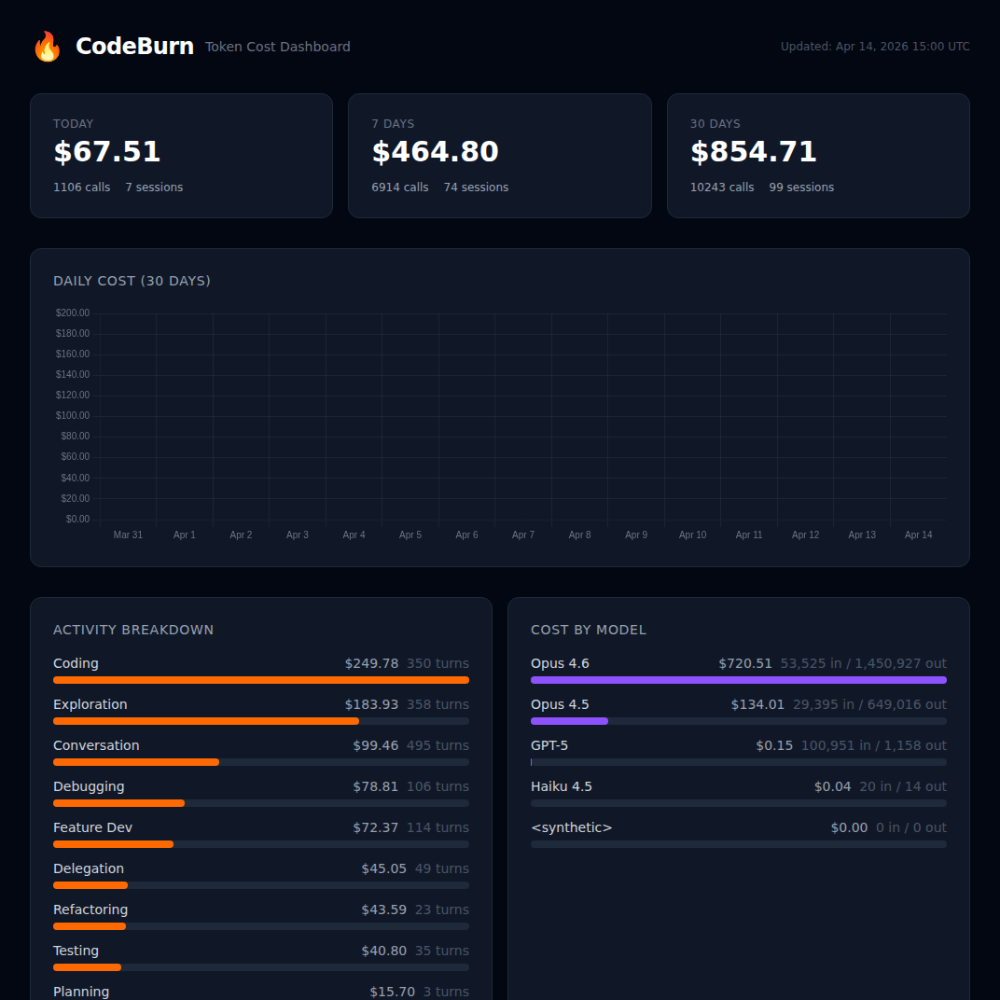
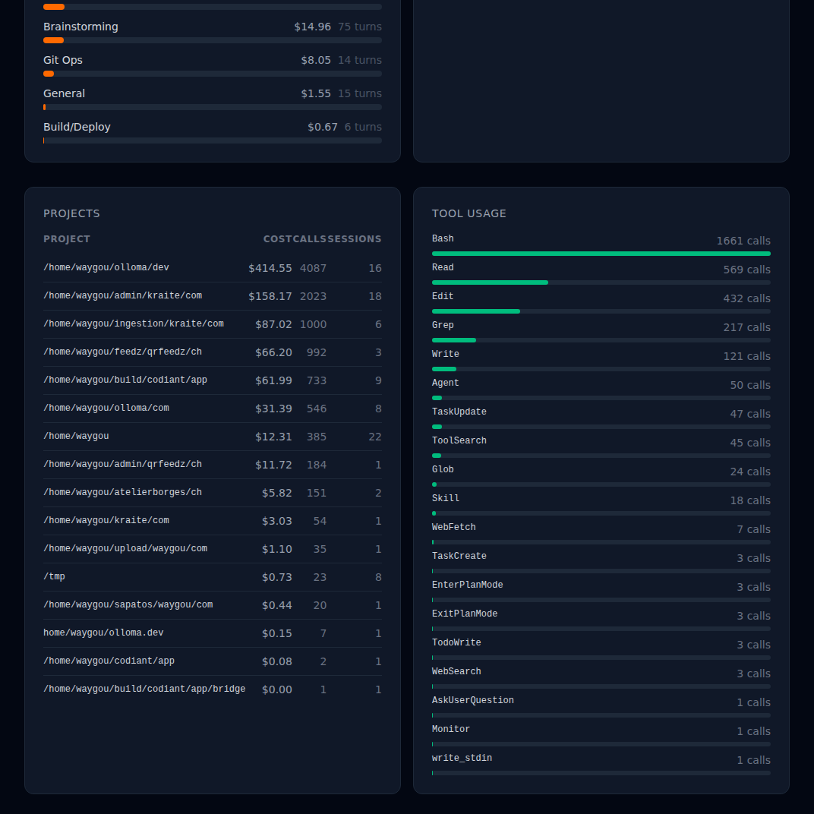

<p align="center">
  
</p>

<h1 align="center">CodeBurn Web Dashboard</h1>

<p align="center">
  <strong>A web dashboard for <a href="https://github.com/agentSeal/codeburn">CodeBurn</a> — see where your AI coding tokens go.</strong>
</p>

<p align="center">
  Built with Laravel 12 + Tailwind CSS 4 + Chart.js
</p>

---

CodeBurn gives you a TUI to track your Claude Code token spend. This project wraps it in a **web dashboard** you can access from any browser — deployed on your own server, always up to date.

Every page load runs `codeburn export` fresh, so you're always looking at real-time data.

## What you get

- **3 period cards** — Today, 7 Days, 30 Days with total cost, API calls, and sessions
- **Daily cost chart** — bar chart showing spend over the last 30 days
- **Activity breakdown** — Coding, Debugging, Exploration, Conversation, etc. with cost and turn count
- **Model costs** — per-model breakdown (Opus, Sonnet, Haiku, GPT-5, Gemini, etc.)
- **Projects table** — cost per project directory
- **Tool usage** — which tools Claude uses most (Bash, Edit, Read, Grep, etc.)

<p align="center">
  
</p>

## Requirements

- PHP 8.4+
- Node.js 20+
- Composer
- [CodeBurn](https://github.com/agentSeal/codeburn) installed globally (`npm install -g codeburn`)
- Claude Code (reads `~/.claude/projects/` session data)
- A web server (Nginx, Apache, etc.)

## Installation

```bash
# Clone the repo
git clone https://github.com/brunocfalcao/codeburn.git
cd codeburn

# Install dependencies
composer install --no-dev
npm install && npm run build

# Configure environment
cp .env.example .env
php artisan key:generate
```

Edit `.env`:

```env
APP_NAME=CodeBurn
APP_ENV=production
APP_URL=https://your-domain.com
```

No database needed. The dashboard reads directly from CodeBurn's JSON export.

## Web server

Point your web server's document root to the `public/` directory. Standard Laravel setup.

### Permissions

The web server user (e.g., `www-data`) needs to run `codeburn` as the user who owns the Claude Code sessions. Add to sudoers:

```bash
# /etc/sudoers.d/codeburn
www-data ALL=(your-username) NOPASSWD: /usr/bin/codeburn
```

Then update the controller's process call to match your username in `app/Http/Controllers/DashboardController.php`:

```php
->run('sudo -u your-username /usr/bin/codeburn export -f json');
```

## How it works

1. Browser hits the dashboard URL
2. Laravel controller runs `codeburn export -f json`
3. CodeBurn reads Claude Code session transcripts from `~/.claude/projects/`
4. JSON is parsed and rendered with Tailwind CSS + Chart.js
5. Temporary export file is cleaned up after each request

No caching, no database, no cron jobs. Fresh data on every page load.

## Tech stack

| Component | Version |
|---|---|
| Laravel | 12 |
| Tailwind CSS | 4 |
| Chart.js | 4 |
| PHP | 8.4+ |
| Node.js | 20+ |

## Credits

- [CodeBurn](https://github.com/agentSeal/codeburn) by [AgentSeal](https://agentseal.org) — the TUI that powers the data
- [LiteLLM](https://github.com/BerriAI/litellm) — pricing data

## License

MIT
